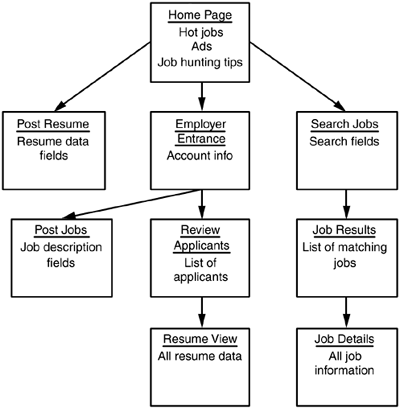

# Story-Writing Workshop

> The most effective way to quickyl trawl for stories

* Brainstorm the things a user may want to do at various points while using the application
* Meeting that includes developers, users, the product customer and other parties who can contribute by writing stories.
* Write as many stories as they can. 
* No priorities are associated with the stories at this point.
* Built up iteratively

> Low-fidelity prototype. It's done on paper, note cards, or a white board and maps very high level interactions within the planned software. 
> A prototype is not a long-term artifact of your development process and you don’t want to cause any confusion by keeping it around

:x: Identify actual screens and fields,
:heavy_check_mark: The conceptual workflows are identified.

Each box represents a new **component** of the website. The arrows between the boxes represent **links** between the components. For a website, a component may be either a new page or space on the current page. 

## Steps

1. Decide which of the system's user roles or personas you'd like to start with. You’ll repeat the process using each role or persona so the order does not matter. 
2. Draw an empty box and tell the participants that it is the main screen of the software, and ask them what the selected user role or persona can do from there. 
3. The meeting participants will start throwing out ideas about what actions the role or persona can take. 
4. For each action, draw a line to a new box, label that box, and write a story.

The discussion will generate stories such as:

* A Job Seeker can post her resume.
* An Employer can post jobs.
* An Employer can review submitted resumes.
* A Job Seeker can search for jobs.
* A Job Seeker can view results of jobs that match a search.
* A Job Seeker can view details about specific jobs.

> Depth-first approach: For the first component, write down its salient details, then move to a component connected to the first and do the same. Then, move to a component connected to that one, rather than going back to the first component and first describing each component connected to it.

**Extra questions**. Think about the user roles and personas as you ask these questions.

* What will the user most likely want to do next?
* What mistakes could the user make here?
* What could confuse the user at this point?
* What additional information could the user need?

> Focus should be on quantity rather than quality.

> Discussion during a user story workshop should remain at a very high level.